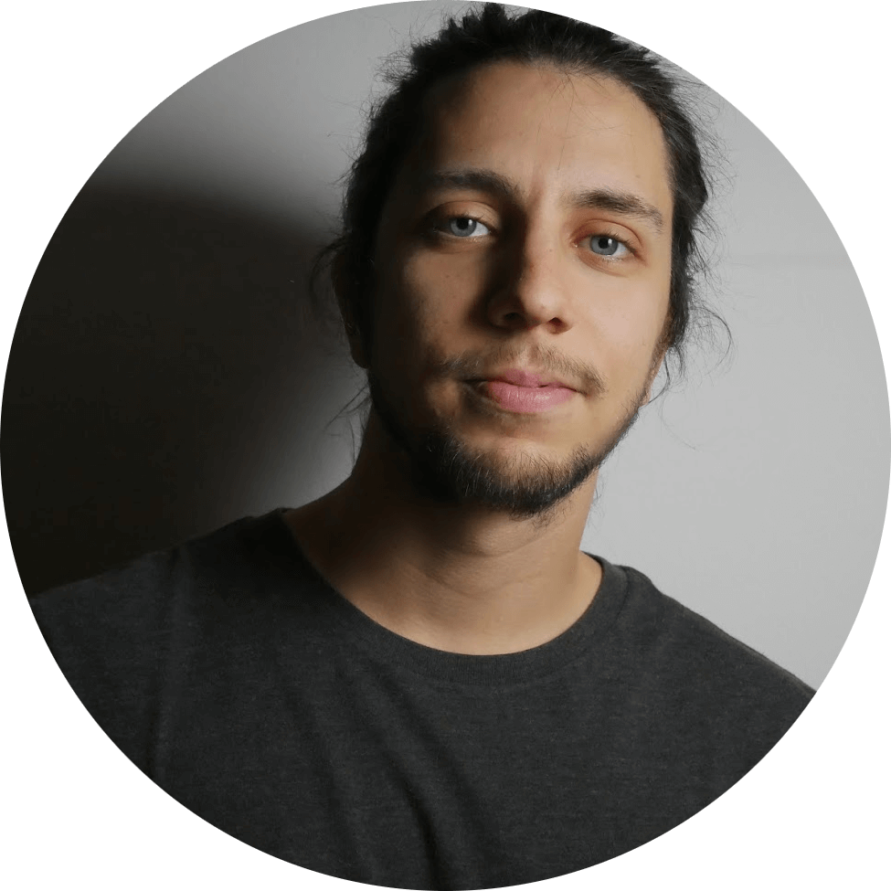

# Marco Ferretti

_Software engineer based in Bologna 🇮🇹_

[Email](mailto:mferretti93@gmail.com) / [LinkedIn](https://www.linkedin.com/in/marco-ferretti195/) / [GitHub](https://github.com/marcodellemarche/) / [Instagram](https://www.instagram.com/marcodellemarche/)

## 💻 Engineering Experience

**Fullstack Developer** @ [CUBBIT](https://cubbit.io/) _(Jul 2021 - Present)_

Geo-distributed cloud storage platform based on a peer-to-peer network of nodes.

- Worked in an agile team to build a public web app based on React
- Joined a new team to build the core of Cubbit's technology, developing and maintaining microservices written in NodeJS, Rust and Go
- Contributed to the design of a PostgreSQL database, monitoring and improving its performance according to needs
- Daily work with other side tools such as Docker, Kubernetes, Bazel and Kafka
- **_Technologies used:_** TypeScript, React, Jest, HTML, CSS, Node.js, Rust, Go, PostgreSQL, Kafka, Docker, Bazel, Kubernetes.

**Frontend Developer** @ [JMA Wireless](http://jmawireless.com/) _(Oct 2019 - Jul 2021)_

Software-driven 4G mobile provider, designed specifically for in-building and outdoor use.

- Configured CentOS Dell servers from the first boot-up to the final setup to be sent to customers
- Automated a few installation processes with some Bash and Python scripts
- Developed an internal web tool based on Angular, to install and monitor these servers
- **_Technologies used:_** Angular, TypeScript, Node.js, Bash, Python.

## 📡 Telecommunications Experience

_This section only accounts for work done post-career change._

**Field Engineer** @ [JMA Wireless](https://www.jmawireless.com/en) _(Apr 2018 - Oct 2019)_

Software-driven 4G mobile provider, designed specifically for in-building and outdoor use.

- Worked in a team from both Italy and USA to configure 4G mobile radio parameters, to fit specific customer needs
- Moved on a few business trips to help customers to install servers on-site and help them with the troubleshooting

## 👨‍🎓 Education

**Master's Degree in Telecommunications Engineering** @ [Università di Bologna](https://www.unibo.it/) _(Oct 2015 - Marc 2018)_

**Bachelor's Degree in Electronic Engineering** @ [Università Politecnica delle Marche](https://www.univpm.it/) _(Oct 2012 - Jul 2015)_

## 🚃 Other courses

**Railway high formation course** @ [Rete Ferroviaria Italiana](https://www.rfi.it/) _(Jun 2017 - Aug 2017)_

Followed a 3 months university course on the Italian railway system.

## 💬 Languages

🇮🇹 **Italian**: Native

🇺🇸 **English**: C2

🇪🇸 **Spanish**: B2
