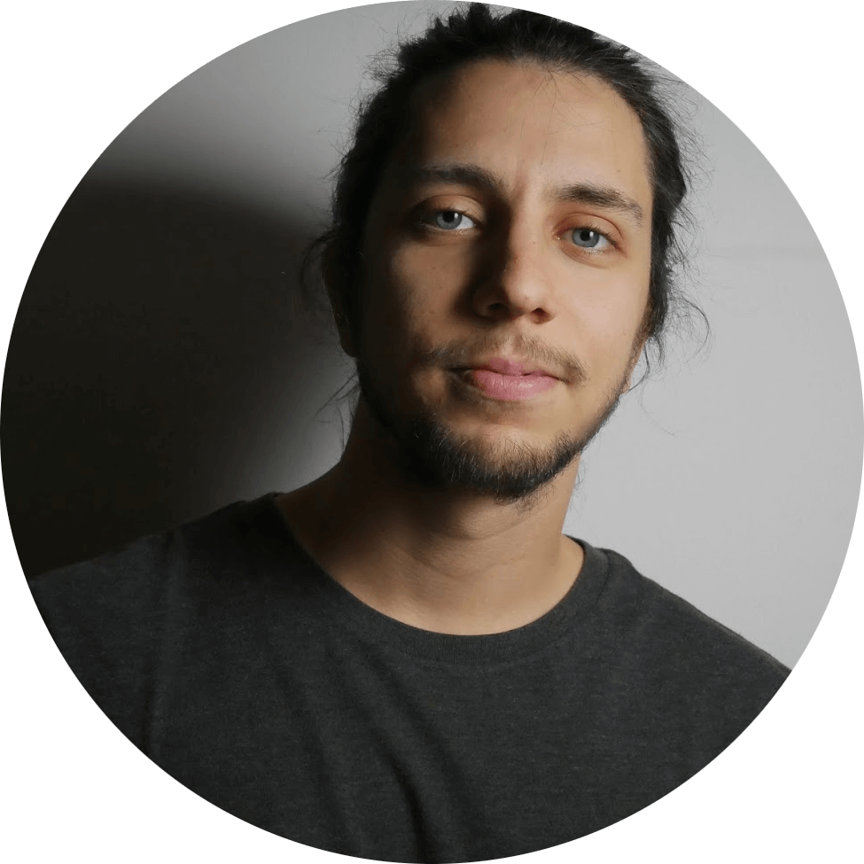

# Marco Ferretti

*Full stack software engineer, remote working but based in Bologna* 🇮🇹

[Email](mailto:mferretti93@gmail.com) / [LinkedIn](https://www.linkedin.com/in/marcodellemarche) / [GitHub](https://github.com/marcodellemarche) / [Instagram](https://www.instagram.com/marcodellemarche) / [Remote Workers](https://rok.co/@marcodellemarche)

📎 Download this CV [as a PDF](https://github.com/marcodellemarche/cv/releases/download/latest/marco-ferretti-cv.pdf)

## 💻 Engineering Experience

**Fullstack Developer** @ [CUBBIT](https://cubbit.io) _(Jul 2021 - Present)_

Geo-distributed cloud storage platform based on a peer-to-peer network of nodes.

- For the first year, I worked in the frontend team to build a public web app based on React.
- Then, I joined the backend team to build the core of Cubbit's technology, developing microservices written in NodeJS, Rust and Go.
- Design and maintenance of a PostgreSQL database, monitoring and improving its performance making it scale from zero usage to billions of rows.
- During the daily life of the team, I am used to prepare tasks descriptions and make code reviews.
- Side experience with other tools/technologies such as Docker, Kubernetes, Redis and Kafka.
- Particular focus of the team on testing, especially in unit and E2E testing.
- Co-hosted some recruitment meetings, where I mostly focused on the technical questions.
- **_Technologies used:_** TypeScript, Node.js, Go, Rust, React, Jest, PostgreSQL, Kafka, Docker, Kubernetes, Bazel.

**Frontend Developer** @ [JMA Wireless](http://jmawireless.com) _(Oct 2019 - Jul 2021)_

Software-driven 4G mobile provider, designed specifically for in-building and outdoor use.

- Configured CentOS Dell servers from the first boot-up to the final setup to be sent to customers
- Automated a few installation processes with some Bash and Python scripts
- Developed an internal web tool based on Angular, to install and monitor these servers
- **_Technologies used:_** Angular, TypeScript, Node.js, Bash, Python.

## 📡 Telecommunications Experience

_This section only accounts for previous experiences not related to software development._

**Field Engineer** @ [JMA Wireless](https://www.jmawireless.com) _(Apr 2018 - Oct 2019)_

Software-driven 4G mobile provider, designed specifically for in-building and outdoor use.

- Worked in a team from both Italy and USA to configure 4G mobile radio parameters, to fit specific customer needs
- Moved on a few business trips to help customers to install servers on-site and help them with the troubleshooting

## 👨‍🎓 Education

**Master's Degree in Telecommunications Engineering** @ [Università di Bologna](https://www.unibo.it) _(Oct 2015 - Marc 2018)_

**Bachelor's Degree in Electronic Engineering** @ [Università Politecnica delle Marche](https://www.univpm.it) _(Oct 2012 - Jul 2015)_

## 🚃 Other courses

**Railway high formation course** @ [Rete Ferroviaria Italiana](https://www.rfi.it) _(Jun 2017 - Aug 2017)_

Followed a 3 months university course on the Italian railway system.

## 💬 Languages

🇮🇹 **Italian**: Native

🇺🇸 **English**: Fluent

🇪🇸 **Spanish**: Communicative

_I authorize the processing of personal data contained in my curriculum vitae based on art. 13 GDPR 679/16._
